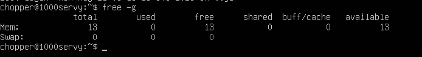

# CPU less than Guest

# RAM less than Guest

# RAM more than Guest
I could only add up to 14400MB of RAM in VirtualBox.

# CPU more than Guest
I was able to add double (8) the number of cores that my guest has (4).

