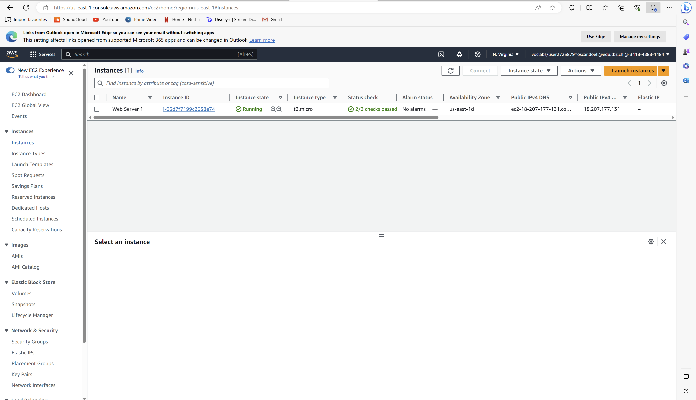
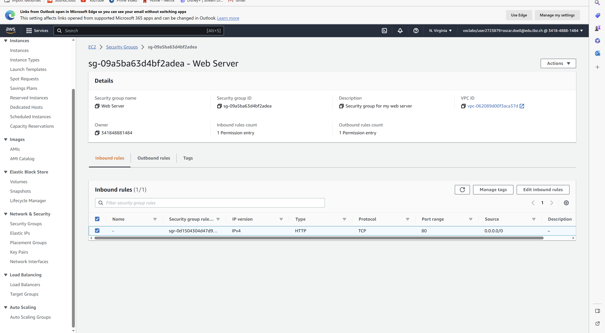
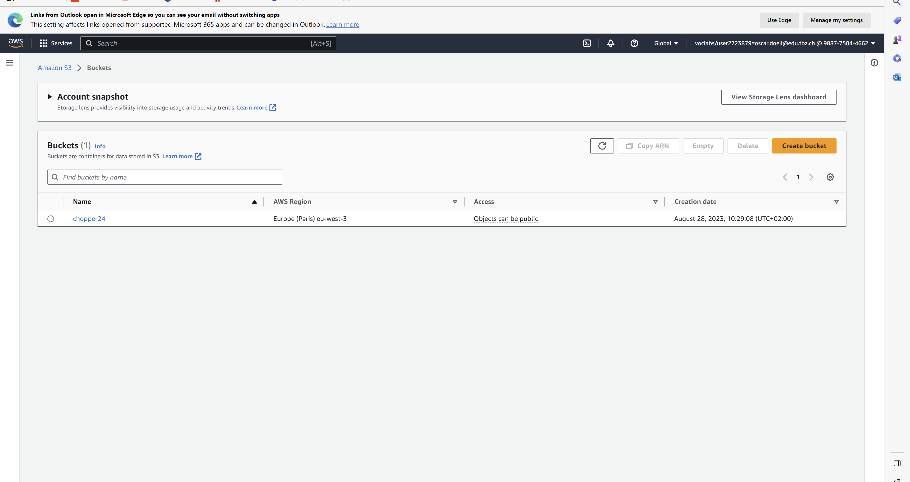
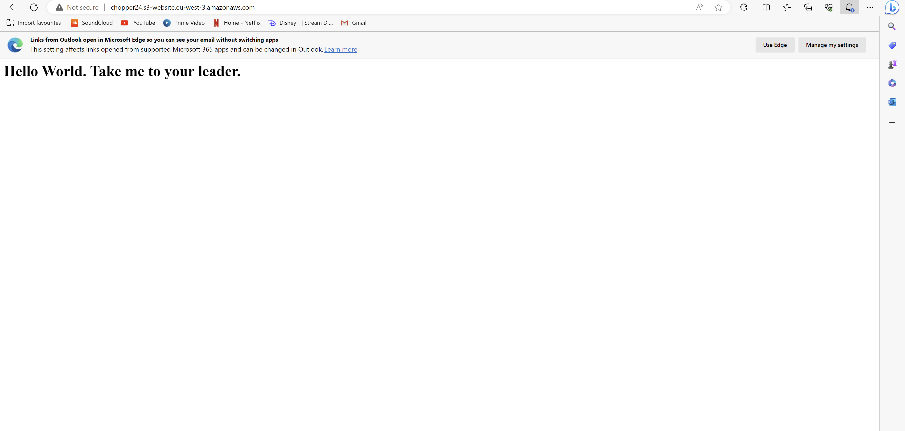
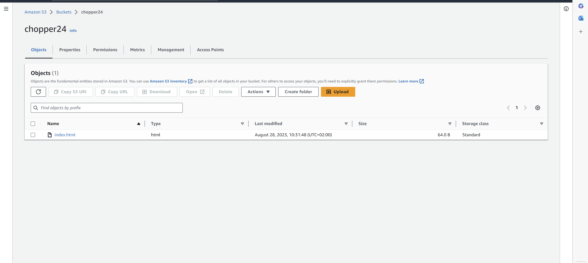

# Lab 4.1

## HTML-Seite, inkl. URL

## Liste der EC2-Instanzen

## Details der Web Server-Instanz (öffentliche IP sichtbar)

## Security-Group: Liste der Inbound-Regeln.

# Lab 4.2

## Liste der Buckets.

## HTML-Seite, inkl. URL.

## Liste der Dateien im Bucket.

## Eigenschaften von "Static website hosting"

