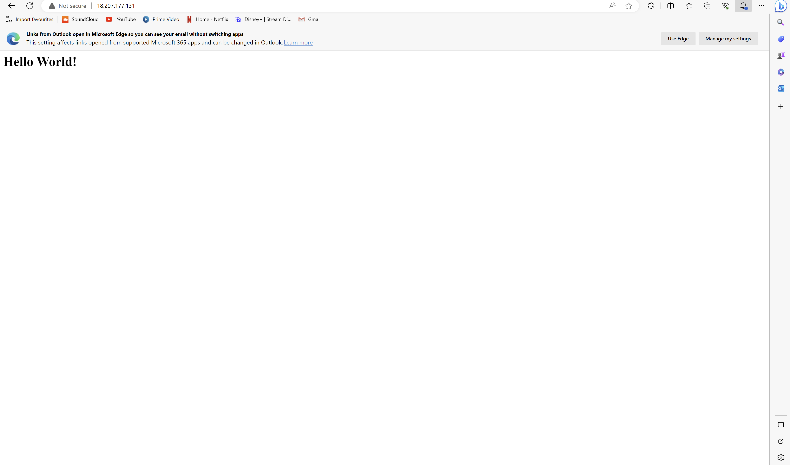
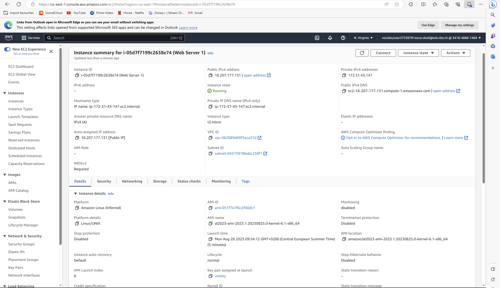
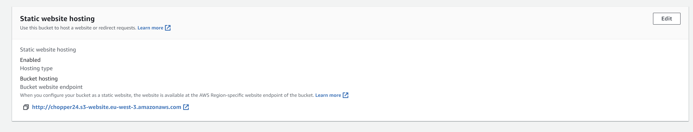
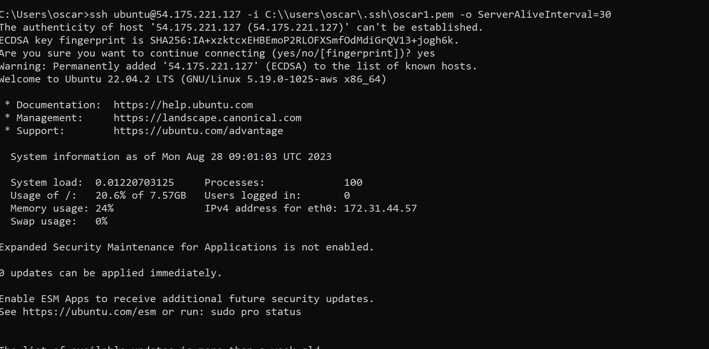
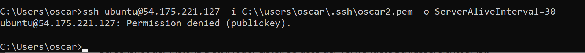
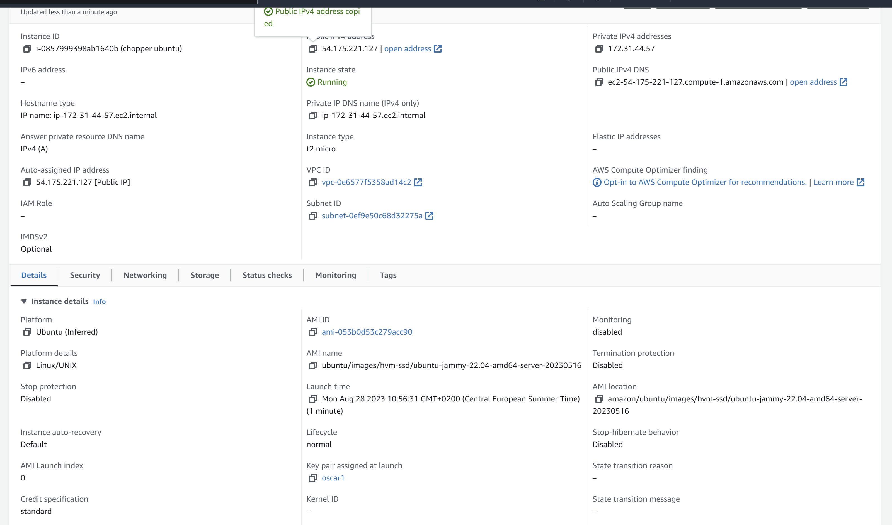
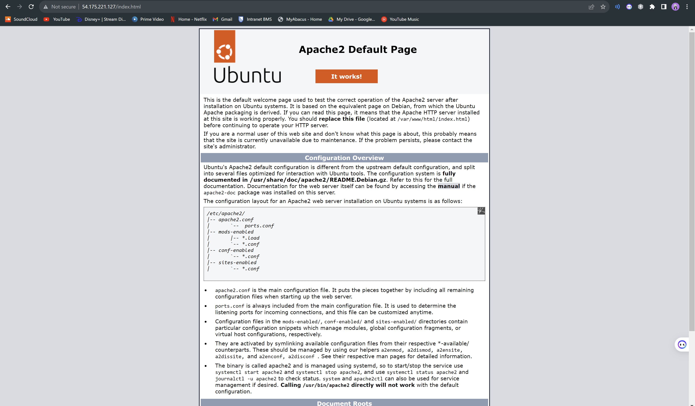
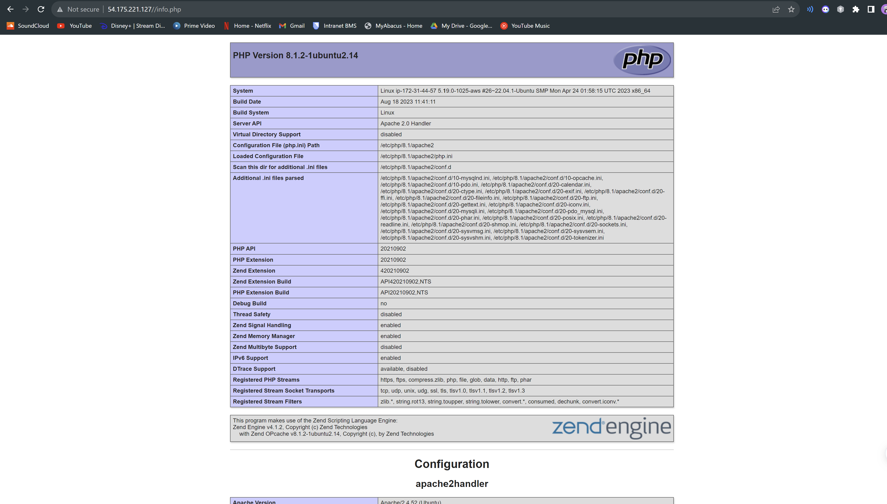
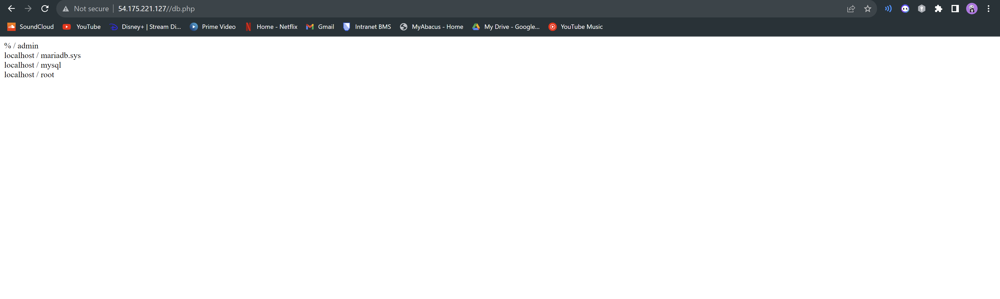

# Lab 4.1

## HTML-Seite, inkl. URL

## Liste der EC2-Instanzen

## Details der Web Server-Instanz (öffentliche IP sichtbar)

## Security-Group: Liste der Inbound-Regeln.

# Lab 4.2

## Liste der Buckets.

## HTML-Seite, inkl. URL.

## Liste der Dateien im Bucket.

## Eigenschaften von "Static website hosting"

# B

## Screenshot mit dem ssh-Befehl und des Resultats unter Verwendung des ersten Schlüssels

## Screenshot mit dem ssh-Befehl und des Resultats unter Verwendung des zweiten Schlüssels

## Screenshot der Instanz-Detail (oder Liste), so dass der verwendete Schlüssel sichtbar ist.

# C

## Apache

## PHP 

## PHP DB

