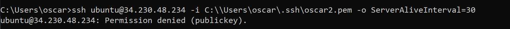
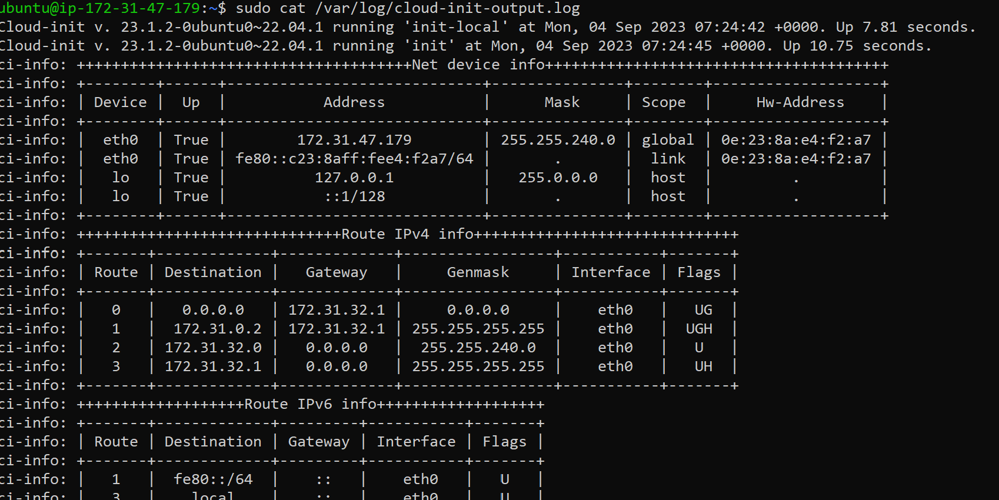

# B
## Ein Screenshot der Details oder Liste der Instanz, welcher den verwendeten Key zeigt.

## Screenshot mit dem ssh-Befehl und des Resultats unter Verwendung des ersten Schlüssels.

## Screenshot mit dem ssh-Befehl und des Resultats unter Verwendung des zweiten Schlüssels.

## Screenshot mit dem Auszug aus dem Cloud-Init-Log.

