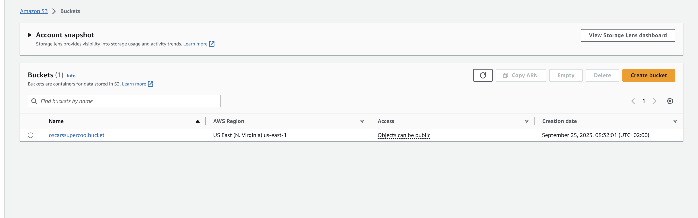
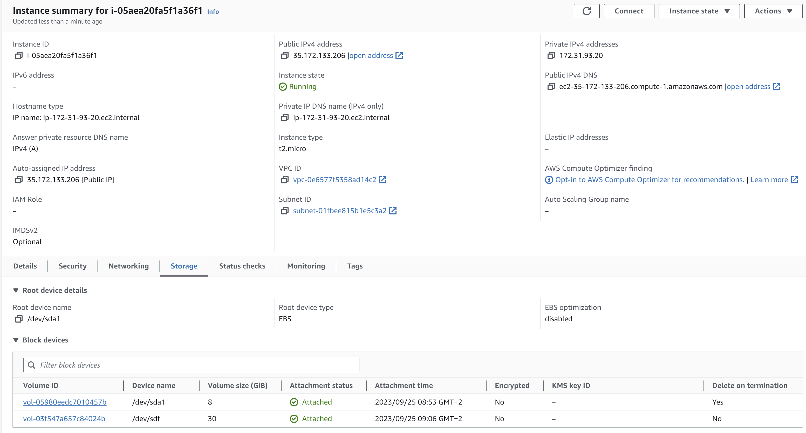

# KN04
# A
## S3 Bucket

## Image

# B
## image.php

# C
## 2nd volume

# D
| Name           | Typ  | Persistenz |
|----------------|------|------------|
| EBS Root       | Hot  | Nein       |
| EBS 2nd volume | Hot  | Ja         |
| S3             | Warm | Ja         |

EBS Root ist hot weil es den web server hostet und die image.php datei immer zur verfügung stellen muss es ist aber nicht persistent denn es löscht die Dateien nach dem herunterfahren der Instanz.

EBS 2nd volume ist cold weil es nichts zur verfügung stellt es ist aber persistent weil es die Daten nicht löscht nachdem die Instanz heruntergefahren wird.

S3 ist hot weil es das Bild für den image.php file zur verfügung stellt und es ist persistent weil die Daten nicht nach dem Heunterfahren gelösch werden.
