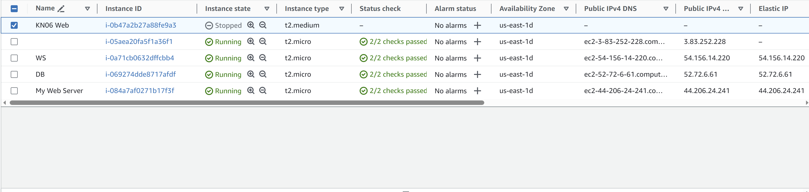

# KN06
## A
Ein Reverse Proxy ist ein Server, der Anfragen von Clients entgegennimmt und sie an andere Server weiterleitet. Er wird verwendet, um den Zugriff auf Ressourcen, wie Webseiten, auf verschiedene Backend-Server zu verteilen und Sicherheit sowie Leistungsoptimierung bereitzustellen.

## B
Als ich den Speicher erweitern wollte kam diese Nachricht "If you are increasing the size of the volume, you must extend the file system to the new size of the volume. You can only do this when the volume enters the optimizing state.". es heisst also der Speicher kann nur erweitert werden wenn der SPeicher optimiert wird.

Ich musste die Instanz stoppen damit ich den Instanz Typ ändern konnte.

## C 
Ich habe ein standard load balancer erstellt und meine 2 instanzen dort eingegeben.

Wenn meine Anwendung unter 'app.tbz-m346.ch' läuft, müsste ich die DNS so konfigurieren, dass sie, wenn sie diese URI erkennt, auf die URL des Load-Balancers verweist. Auf der Detailseite des Load-Balancers wird ein DNS-Eintrag hinzugefügt, um dies zu definieren.
## D 
Ich habe die Schritte bei dem Aut Scaler verfogt und meine bereits erstellten instanzen wurden hinzugefügt. 
