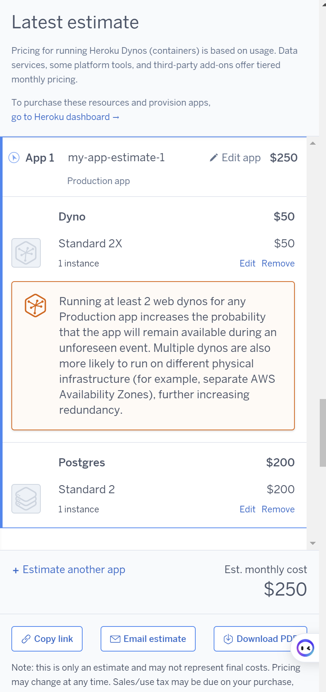
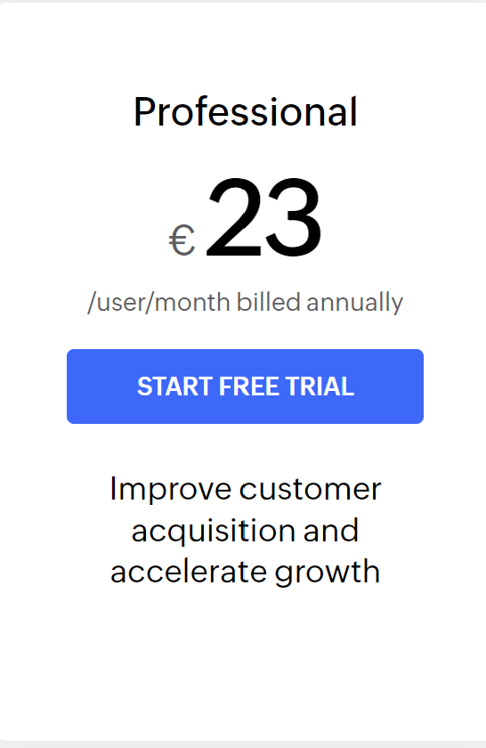
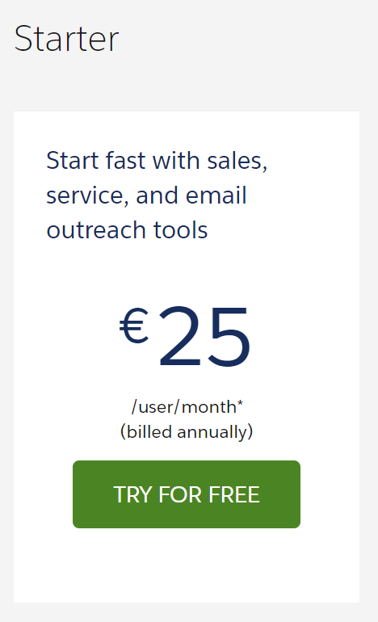

# KN07
# A
## AWS

### Pro: 
- Die Backups passieren schneller und sind immer noch billiger als bei azure.
- Der Webserver hat 5 Gbit Netzwerk.
### Contra:
- Load Balancer ist im gegensatz zu Azure nicht gratis und ziemlich teuer.
- Der Datenbank server ist trotz weniger speicher immer noch teurer als bei azure.
## Azure

### Pro: 
- Der Load Balancer ist gratis.
- Die Datenbank hat 128 GB storage und ist immer noch billiger als bei AWS.
### Contra:
- Der Webserver muss zusätzlicher speicher haben, ohne, dass man mehr cores oder RAM hinzufügt und ist deshalb teurer.
- Backup ist teuer.

## Heroku

- Eco und Basic ist zu wenig, also muss Production genommen werden.
- Standard 2x hat 1GB RAM, was ein bisschen zu wenig ist, aber die nächste Stufe wäre zu viel RAM und es wäre 200CHF/Monat mehr.
- Die Datenbank hat 256GB Speicher, weil die kleinere Stuffe nur 64GB ist.
- Die restlichen optionen wurden ausgelassen, weil sie nicht notwendig waren.
## Zoho CRM

- Die Professional Stufe ist 2CHF weniger pro user pro monat und stellt mehr features zu verfügung.
## Salesforce

- Die Small Business Starter option ist die Option, die am meisten Sinn macht für die Grösse des Teams. Es ist aber imer noch teurer und hat weniger features.

# B
## wie stark unterscheiden sich die Angebote?
Die Angebote unterscheiden sich untereinander (rehosting, replantforming, repurchasing) nicht viel. Aber replantforming und repurchasing ist deutlich teurer als rehosting. 
## Welches ist das billigste?
Rehosting insbesondere azure.
## Wieso ist eines davon viel teurer? Ist es aber wirklich teurer?
Die replatforming und repurchasing Angebote sind zwar deutlich teurer, aber sie bieten viel mehr an, als die anderen.
